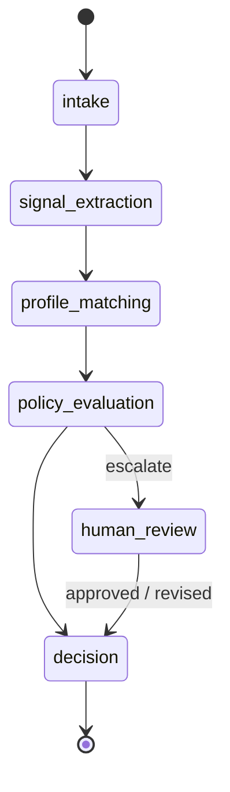

# Architecture — Bounded Application Workflow

Agent-oriented design: specialized bounded agents.

  

<em>Target runtime — full flow.</em>

Priorities: bounded execution · explicit state transitions · observable decision chains · controllable autonomy · human oversight.

Agentic behavior is introduced incrementally and constrained by explicit policies.

---

## Workflow Runtime — Milestone 3 (completed)

Milestones 1–2 delivered the evaluation engine with structured signal extraction. Milestone 3 adds bounded orchestration on top.

### Workflow State Machine

Each state has a defined entry condition, responsible agent, and output contract. Transitions are explicit and logged.

### Agent Boundaries

| Stage | Agent | Input | Output |
| ----- | ----- | ----- | ------ |
| signal_extraction | Signal Extractor | raw job description | `JobSignals` |
| profile_matching | Profile Matcher | `JobSignals` + `UserProfile` | `ProfileMatchResult` |
| policy_evaluation | Decision Policy | `ProfileMatchResult` | `WorkflowDecision` |
| human_review | Human Review Gate | escalated decision | approved or revised decision |
| orchestration | Workflow Orchestrator | workflow input | state-managed `WorkflowOutput` |

Planning (scope, signals, guardrails) is separated from execution (running agents, applying policy).

### Runtime Records

Every run is fully reconstructable from its records:

| Record | Purpose |
| ------ | ------- |
| `WorkflowRun` | Complete record of one execution: input, plan, state history, events, traces, review, output |
| `WorkflowPlan` | Stages selected before execution; compared against actual execution in a `PlanExecutionReport` |
| `WorkflowEvent` | Timestamped log entry for every state transition, agent completion, and review action |
| `AgentTrace` | Output of each agent invocation, correlated with its `AGENT_COMPLETED` event |
| `HumanReviewRecord` | Why a run escalated and how the review was resolved (approved or revised) |

Later milestones (LLM runtime, retrieval, memory, eval, multi-agent, production platform): [ROADMAP.md](./ROADMAP.md).

---

## Principles

| Principle | Meaning |
| --------- | ------- |
| Bounded autonomy | Agents operate within explicit policy constraints |
| Human oversight | High-ambiguity decisions escalate for review |
| Observable reasoning | Decisions remain inspectable and debuggable |
| Modular agents | Composable components, not hidden monolithic prompts |
| Production orientation | Reliability and evaluation over unconstrained autonomy |

---

## Influences

- [OpenClaw](https://github.com/openclaw/openclaw)
- [LangGraph](https://github.com/langchain-ai/langgraph)
- [OpenAI Agents SDK](https://github.com/openai/openai-agents-python)
