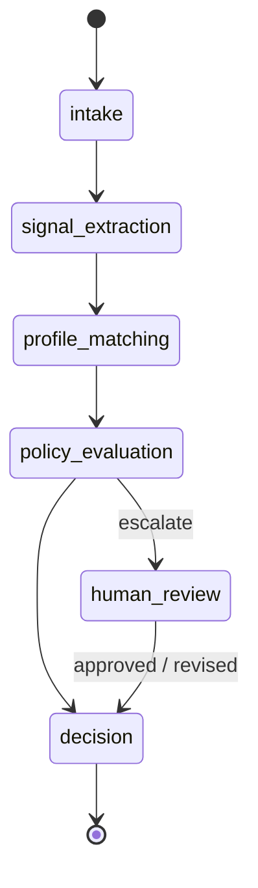

# Architecture — Bounded Application Workflow

Specialized bounded agents behind typed contracts. Priorities: bounded execution · explicit state transitions · observable decisions · human oversight.

  

---

## Workflow — Milestone 3 (completed)

M1–2 delivered the evaluation engine and signal extraction; M3 adds bounded orchestration on top. Each state has one responsible agent with a typed input/output contract, planning is separated from execution, and transitions are explicit and logged.

Pipeline: `signal_extraction` → `JobSignals` → `profile_matching` → `ProfileMatchResult` → `policy_evaluation` → `WorkflowDecision`, escalating to `human_review` before the final `decision`.

Every run is reconstructable from `WorkflowRun` (input, plan, events, traces, review, output) via `WorkflowPlan`/`PlanExecutionReport`, `WorkflowEvent`, `AgentTrace`, and `HumanReviewRecord`.

---

## Agent Runtime — Milestone 4 (in progress)

Shared execution path for LLM-backed agents behind the same `Protocol` contracts — orchestrator and workflow stay unchanged. `BoundedAgentRuntime` runs an operation through a timed, bounded-attempt lifecycle (per `RuntimeConfig`: `agent_name`, `config_version`, `max_attempts`) and returns an `AgentExecutionResult` with status, attempts, timing, and typed output or contained error. Errors are contained, not raised, so a failing agent never breaks the workflow. Schema validation, fallback, prompt versioning, and tracing build on this in later M4 issues.

---

## Influences

- [OpenClaw](https://github.com/openclaw/openclaw)
- [LangGraph](https://github.com/langchain-ai/langgraph)
- [OpenAI Agents SDK](https://github.com/openai/openai-agents-python)
