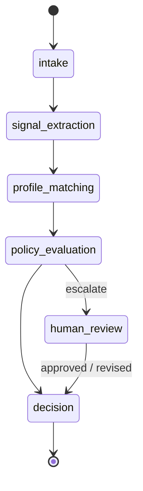
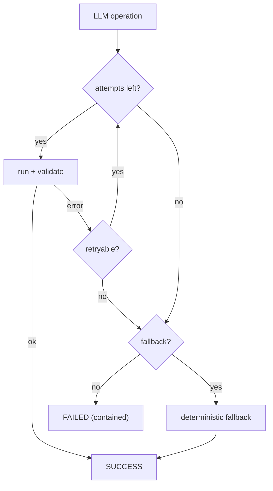

# Architecture — Bounded Application Workflow

Specialized bounded agents behind typed contracts. Priorities: bounded execution · explicit state transitions · observable decisions · human oversight.

  

---

## Workflow — Milestone 3 (completed)

M1–2 delivered the evaluation engine and signal extraction; M3 adds bounded orchestration on top. Each state has one responsible agent with a typed input/output contract, planning is separated from execution, and transitions are explicit and logged.

Pipeline: `signal_extraction` → `JobSignals` → `profile_matching` → `ProfileMatchResult` → `policy_evaluation` → `WorkflowDecision`, escalating to `human_review` before the final `decision`.

Every run is reconstructable from `WorkflowRun` (input, plan, events, traces, review, output) via `WorkflowPlan`/`PlanExecutionReport`, `WorkflowEvent`, `AgentTrace`, and `HumanReviewRecord`.

---

## Agent Runtime — Milestone 4 (completed)

Shared execution path for LLM-backed agents behind the same `Protocol` contracts — the orchestrator and state machine stay unchanged. An agent's LLM call is wrapped by `BoundedAgentRuntime`, which runs it through a bounded, observable lifecycle and returns an `AgentExecutionResult`; the runtime itself never raises — every outcome, success or failure, comes back as a result. A fallback lets a failing agent degrade to a deterministic result. How a `FAILED` result is handled is the caller's choice: `LLMSignalExtractor` unwraps it, so a run breaks only if the LLM and its deterministic fallback both fail.

How the pieces fit together:

- **Execution** — `BoundedAgentRuntime` runs the operation up to `max_attempts` (from the agent's `RuntimeConfig`), timing each run and recording status, attempts, and typed output or contained error.
- **Validation** — a `PydanticOutputValidator` re-validates each candidate output against its schema; invalid output fails the attempt.
- **Fallback & retry** — a `RetryPolicy` decides which errors are retryable; once attempts are exhausted, a deterministic fallback (e.g. `DefaultSignalExtractor`) produces a typed result instead.
- **Versioning** — prompts (`PromptRegistry`, `app/agents/{agent}/prompts/{version}.txt`) and runtime settings (`ConfigRegistry`, `app/runtime/configs/runtime_{version}.json`) are versioned and content-hashed, selected by `RUNTIME_CONFIG_VERSION`.
- **Tracing** — each `AgentExecutionResult` carries `config_version`, `config_hash`, `prompt_hash`, attempts, timing, and the fallback flag, and is nested in the run's `AgentTrace` — so a run stays fully reconstructable.
- **Evaluation** — a golden dataset scores extraction quality (precision/recall/F1) per config version, making prompt/config changes measurable.

Details: [runtime](../modules/bounded-application-workflow/app/runtime/README.md) · [agent guide](../modules/bounded-application-workflow/app/agents/README.md) · [evaluation](../modules/bounded-application-workflow/eval/README.md).

---

## Framework Migration — Milestone 5

Migrates the M1–M4 backend onto the stack in [ADR 0001](adr/0001-adopt-modern-agent-stack.md): Pydantic AI (agents), LangGraph (orchestration / state / HITL), Pydantic Logfire (observability), Pydantic Evals (evaluation). Contracts and decision policy stay the same; hand-built primitives are replaced behind them.

**Observability (Logfire):** OpenTelemetry traces across FastAPI, LangGraph, and Pydantic AI (`app/observability.py`) capture per-request / per-node / per-agent latency, tokens, cost, and model settings. Structured agent outputs and HITL audit stay on checkpointed graph state (thin `events` / `traces`); Logfire does not replace that domain record. Optional `LOGFIRE_TOKEN` in the module `.env` — works without a token via console / OTel fallback. Details: [module README](../modules/bounded-application-workflow/README.md#observability).

---

## Influences

- [OpenClaw](https://github.com/openclaw/openclaw)
- [LangGraph](https://github.com/langchain-ai/langgraph)
- [OpenAI Agents SDK](https://github.com/openai/openai-agents-python)
