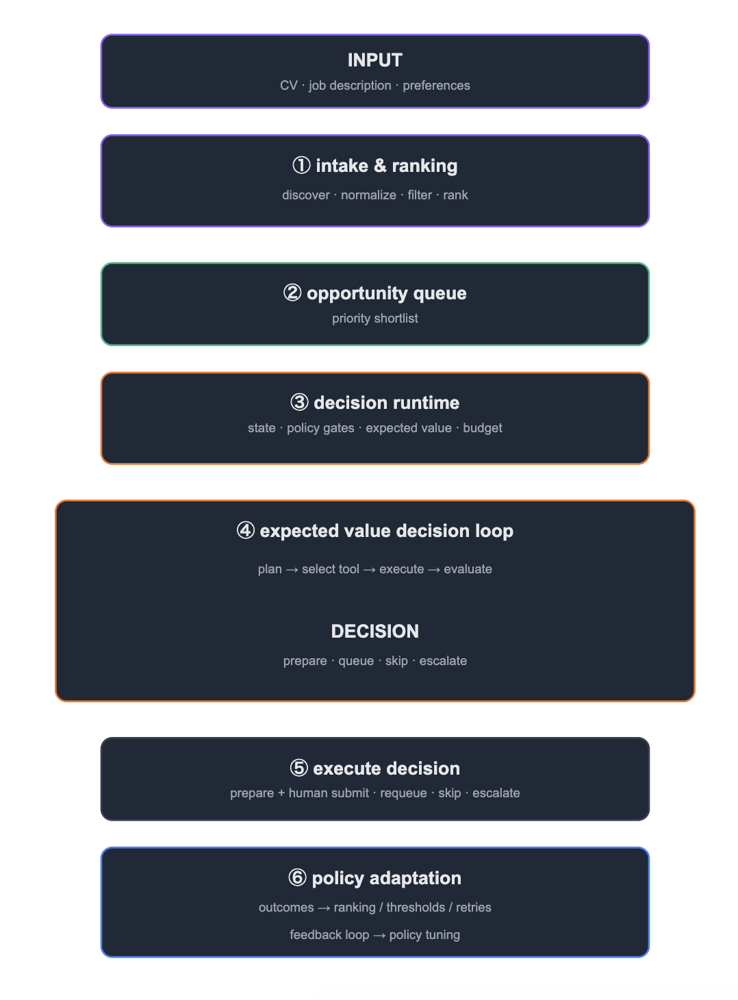

# Bounded Application Workflow

The Bounded Application Workflow is the first workflow inside Liman.
 

It helps users evaluate opportunities, prepare tailored applications, and stay in control of application decisions.
 

The focus is not application volume. 

The focus is fit, clarity, and quality.

## Architecture

 

  

